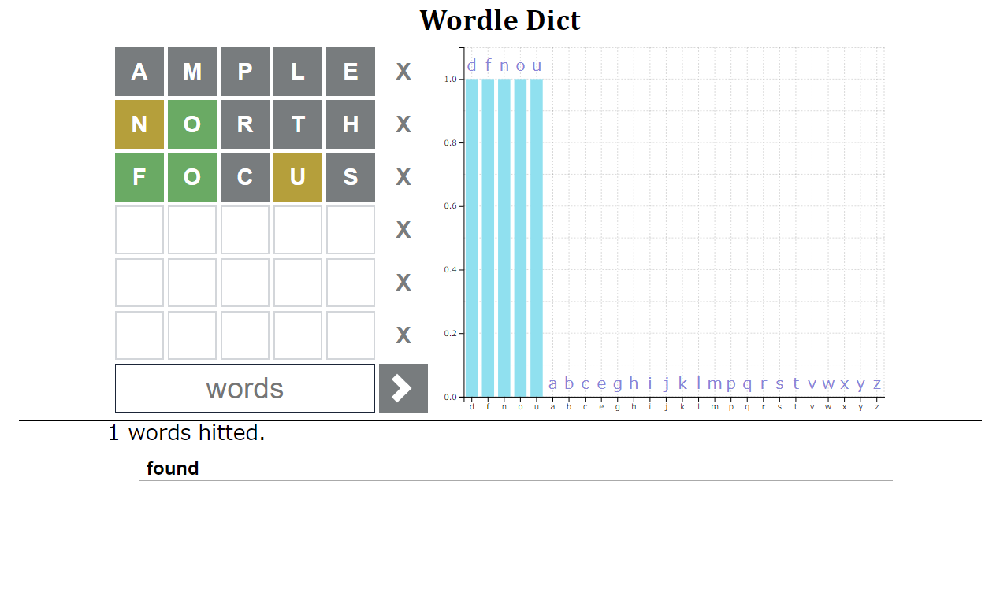

# WordleDict



## Overview

Dictionary web service to solve Wordle.

## Requirement

- release
  - docker-compose
- development
  - python
  - pipenv
  - npm / yarn

## Usage

```bash
$ git clone ...

# 起動確認
$ cd WordleDict/serverside
$ sudo docker-compose build --no-cache
$ sudo docker-compose up

# dockerをサービスに追加
$ cd ../
$ sudo systemctl link serverside/WordleDict.service
Created symlink /etc/systemd/system/WordleDict.service → /path/to/pwd/WordleDict.service.
$ sudo systemctl daemon-reload
$ sudo systemctl enable WordleDict --now
```

add default.conf

```nginx
# server {
    location ~ ^/wordle/.*$ {
        rewrite ^/wordle/(.*)$ /$1 break;
        include uwsgi_params;
        uwsgi_pass unix:/var/www/WordleDict/serverside/tmp/uwsgi.sock;
    }
# }
```

reload nginx

```bash
$ sudo nginx -t
nginx: the configuration file /etc/nginx/nginx.conf syntax is ok
nginx: configuration file /etc/nginx/nginx.conf test is successful
$ sudo nginx -s reload
```

## Description

`http://your.host.name/wordle/` にアクセスすると、Wordle dictのページが表示されます。
インプット欄にWordleに入力した単語を入力し、文字をクリックして色を変更すると対応した単語の一覧と文字の出現率が表示されます。

## Author

[twitter](https://twitter.com/5kdn)

## Licence

[MIT](./LICENSE)
